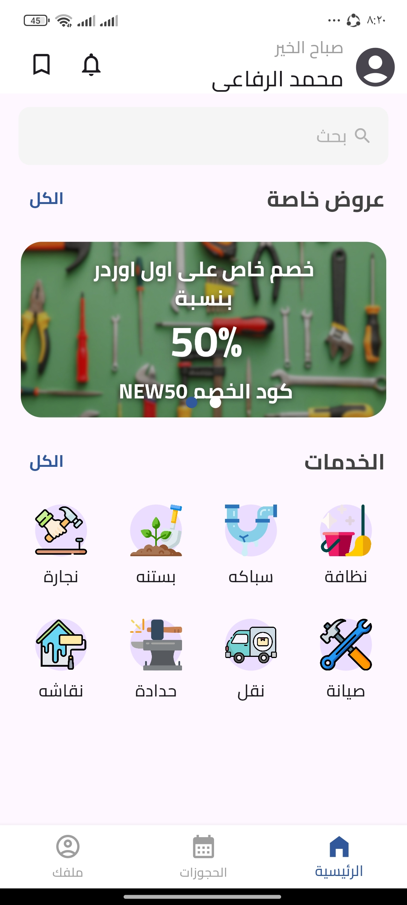
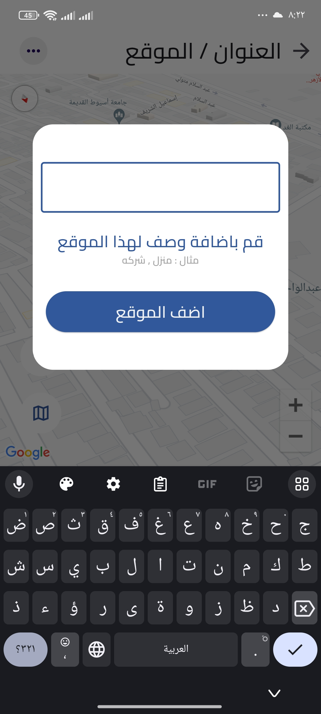
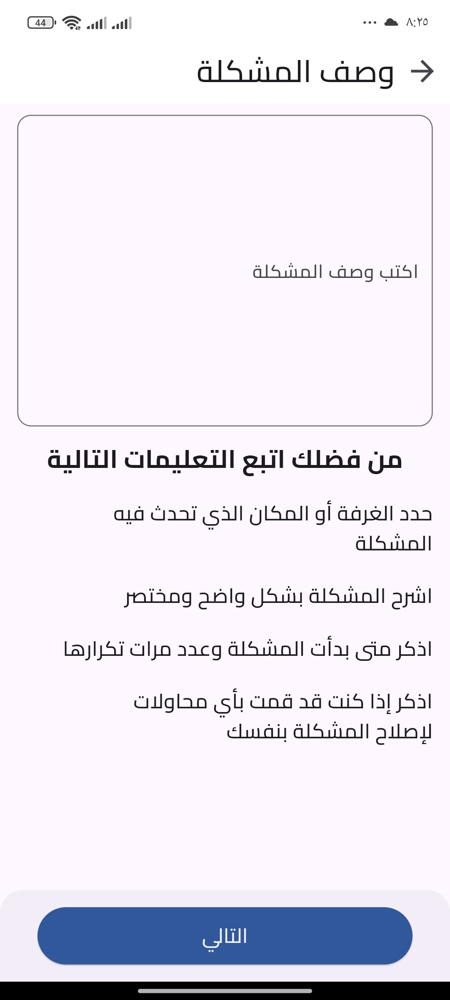
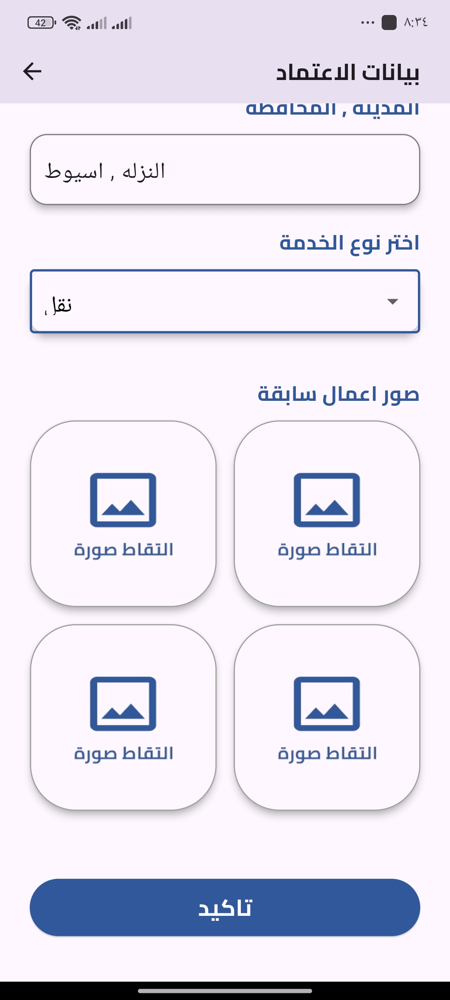

Mahloula

Overview
My project is an application that facilitates connecting workers with homeowners for services such as maintenance, cleaning, moving, and more. The app features a dedicated interface for homeowners and another for service providers,

Features
List key features or functionalities of Mahloula.

- User registration and authentication 
- Service listing
- Search 
- User Profile
- Get User location with google map
- local Notification and storage one
- Get Feedback from users
- Booking and Scheduling  
- and more

...
Screenshots

                                                     

Technologies Used
Flutter: Used for building the frontend UI.
Dart: Programming language used with Flutter.

Installing

bash
Copy code
# Clone the repository
git clone https://github.com/your-username/mahloula.git
cd mahloula
# Install dependencies
flutter pub get
# Run the application
flutter run

Contact
For any questions or inquiries, please contact:

Email: mohamedrfaiy30@example.com
